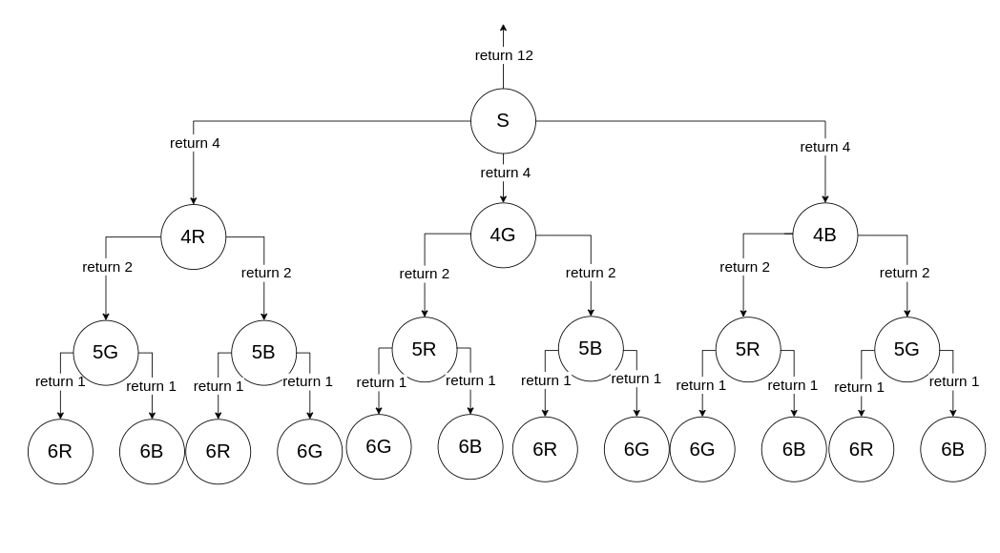

# Grafos 1

## Materiais de Referência:

[Tabela de dificuldade do Codeforces](https://codeforces.com/blog/entry/68288)

[Tabela de dificuldade do AtCoder](https://atcoder.jp/posts/16)

## Harmmonious Graph

Plataforma: Codeforces

Dificuldade: 1700 (Expert)

[Enunciado original](https://codeforces.com/problemset/problem/1253/D)

### Enunciado

Dado um grafo não-direcionado com $N$ nós e $M$ arestas. Nós numerados de 1 a $N$.

O grafo é considerado harmônico se e somente se a seguinte propriedade for satisfeita:

Para uma tripla de inteiros $( l, m, r )$ tais que $1 \leq l < m < r \leq N$, se existe caminho do nó $l$ até o nó $r$, então existe caminho do nó $l$ até o nó $m$.

Em outras palavras, em um grafo harmônico, se a partir de um nó l, é possível chegar em um nó r $( l < r )$, então é possível, a partir de l, chegar em $( l + 1 ), ( l + 2 ), . . . , ( r - 2 ), ( r - 1 )$ também.

### Entrada

A primeira linha é composta por dois inteiros $N$ e $M$ $( 3 \leq N \leq 200 000$ e $1 \leq M \leq 200 000 )$

A $i$-ésima das próximas $M$ linhas contém dois inteiros $u_i$ e $v_i$ $( 1 \leq u_i,v_i \leq N, u_i \neq v_i)$, significando a existência de uma aresta entre $u_i$ e $v_i$.

É garantido que o grafo fornecido é simples (não há auto-loop e há no máximo uma aresta para um par de nós).

### Saída
Imprima o menor número de arestas necessárias a serem adicionadas ao grafo para que ele fique harmônico.

### Solução

Considere o seguinte grafo de exemplo:

Inicialmente, verificaremos se uma componente de um grafo é considerada harmônica. Faremos na ordem crescente dos nós, então escolhemos a componente com o nó 1.

A partir dessa componente, faremos uma bfs para saber quais nós são acessíveis a partir do nó 1, e os adicionaremos em ordem crescente a uma lista de visitados.

BFS(1): {1, 2, 5, 7}
VISITADOS(1): {1, 2, 5, 7}

A partir do nó do qual partimos a BFS, nesse caso o 1, varremos a lista de nós visitados até o maior nó da componente (7). Caso haja descontinnuidade na ordem crescente dos nós, a componente não é harmônica.

Caso a componente não seja harmônica, criaremos uma aresta entre o nó de origem da BFS (1) e o menor nó maior que ele que não está na lista (3).

Dessa forma, o grafo ficará assim:

Então, aplicaremos uma BFS a partir do novo nó que acabamos de criar uma aresta (3). Um detalhe importante, é que nós não passaremos de novo pelos nós visitados na bfs do nó 1.

BFS(3): {3, 4, 6, 8}
VISITADOS(3): {1, 2, 3, 4, 5, 6, 7, 8}

A partir do nó da BFS, nesse caso, o 3, varreremos a lista de visitados até o maior nó da componente (8), e notaremos que não há descontinuidade.

Assim, essa componente é considerada harmôncia, então não há necessidade de criar mais arestas para essa componente.

Em seguida, passaremos para o próximo nó em ordem crescente não visitado (11). Então aplicamos uma bfs nesse nó e os colocaremos na lista de visitados.

BFS(11): {11, 12}
VISITADOS(11): {1, 2, 3, 4, 5, 6, 7, 8, 11, 12}

Por fim, veremos a partir do 11 se há descontinuidades até o maior nó da componente (12). No caso, não há, então o grafo é harmônico.

Abaixo está o link para o código no repositório que resolve esse problema:

[HarmoniousGraph.cpp](./HarmoniousGraph.cpp)

## RGB Coloring 2

Plataforma: Atcoder
Dificuldade: 1804 (Blue)

[Enunciado Original](https://atcoder.jp/contests/abc199/tasks/abc199_d)

### Enunciado

Temos um grafo simples não-direcionado com $N$ vértices e $M$ arestas. Os vértices estão numerados de 1 a $N$, e as arestas de 1 a $M$.

A aresta $i$ conecta os vértices $A_i$ e $B_i$.

Encontre a quantidade de formas de se pintar o grafo, sendo que cada vértice pode ser pintado de vermelho, verde ou azul, de modo que a seguinte condição seja satisfeita:

Dois vértices conectados por uma aresta sempre serão de cores distintas.

### Restrições
 - $1 \leq N \leq 20$
 - $0 \leq M \leq \frac{N(N - 1)}{2}$
 - $1 \leq A_i \leq N$
 - $1 \leq B_i \leq N$
 - O grafo dado é simples (não há multi-arestas ou auto-loops).

### Entrada

A entrada é dada no seguinte formato:

$N$ $M$
$A_1$ $B_1$
$A_2$ $B_2$
$A_3$ $B_3$
.
.
.
$A_M$ $B_M$

### Saída
Imprima o número que represente a quantidade de possibilidades de se printar o grafo.

### Solução

Considere o seguinte grafo para exemplificar o algoritmo:

Inicialmente, definiremos as componentes conectadas do grafo usando uma BFS, dessa forma, obtemos as seguintes componentes:

C1: {1, 2, 3}
C2: {4, 5, 6}

Após a definição das componentes, usaremos a função rgb_color abaixo para definir o número possível de possibilidades para pintarmos uma componente. 

    size_t rgb_color(graph& Gr, int v, vector<color> Cs, vector<int> component){    
    if(v == component.size())
        return 1;
    size_t total = 0;
    for(color c: {R, G, B}){
        if(can_color(Gr, Cs, component[v], c)){
            Cs[component[v]] = c;
            total += rgb_color(Gr, v + 1, Cs, component);
            Cs[component[v]] = W;
        }
    }
    return total;
}

A função rbg_color atua de forma similar a uma DFS, em que a cada iteração da recursão ela tem até 3 possibilidades de colorir um vértice. Caso a iteração da recursão esteja com todos os nós pintados, então foi encontrada uma possível solução, sendo essa a condição de parada da recursão. Uma iteração que não é de parada retornará a soma das possibilidades encontradas nas recursões que estão retornando.

Para a componente C1, a árvore de recursão começando no vértice 1 seria:

Ao terminar de calcular as possibilidades de cor para uma componente, multiplica-se pela quantidade de possibilidades da componente anterior, como essa é a primeira componente, o total inicia-se em 6.

Em seguida, aplicaremos a função rgb_color na componente C2 a partir do nó 5 e teremos uma árvore similar:

Por fim, multiplicaremos a quantidade de possibilidades de C2 que é 12 com o total anterior, tendo agora um total final de 72.

Abaixo está o link para o código no repositório que resolve o problema:

[rgbColoring2.cpp](./rgbColoring2.cpp)

## Police Stations

Plataforma: Codeforces
Dificuldade: 2100 (Master)

[Enunciado Original](https://codeforces.com/problemset/problem/796/D)

### Enunciado

Governar um país não é uma tarefa fácil. Ladrões e terroristas estão sempre prontos para arruinar a paz do país. Para revidar, Zane e Inzane promulgaram uma lei muito eficaz: de cada cidade, deve ser possível chegar a uma delegacia de polícia viajando no máximo $d$ quilômetros pelas estradas.

Existem n cidades no país, numeradas de 1 a $n$, conectadas apenas por exatamente $n - 1$ estradas. Todas as estradas têm 1 quilômetro de extensão. Inicialmente, é possível viajar de uma cidade para qualquer outra usando essas estradas. O país também possui $k$ delegacias de polícia localizadas em algumas cidades. Em particular, a estrutura da cidade atende ao requisito imposto pela lei mencionada anteriormente. Observe também que pode haver várias delegacias de polícia em uma cidade.

No entanto, Zane acredita que ter até $n-1$ estradas é desnecessário. O país está com problemas financeiros, então quer minimizar os custos de manutenção das estradas fechando o máximo possível.

Ajude Zane a encontrar o número máximo de estradas que podem ser fechadas sem infringir a lei. Ajude-o também a determinar quais são essas estradas.

### Entrada

A primeira linha contém três inteiros $n$, $k$ e $d$ $(2 ≤ n ≤ 3·10^5, 1 ≤ k ≤ 3·10^5, 0 ≤ d ≤ n - 1)$ — o número de cidades, o número de delegacias de polícia e o limite de distância em quilômetros, respectivamente.

A segunda linha contém $k$ inteiros $p_1, p_2, ..., p_k (1 ≤ p_i ≤ n)$ — cada um representando a cidade onde cada delegacia está localizada.

A $i$-ésima das $n - 1$ linhas seguintes contém dois inteiros $u_i$ e $v_i$ $(1 ≤ u_i, v_i ≤ n, u_i ≠ v_i)$ — as cidades diretamente conectadas pela estrada com índice i.

É garantido que é possível viajar de uma cidade para qualquer outra usando apenas as estradas. Além disso, é possível, de qualquer cidade, chegar a uma delegacia dentro de $d$ quilômetros.

### Saída

Na primeira linha, imprima um inteiro $s$ que denota o número máximo de estradas que podem ser fechadas.

Na segunda linha, imprima $s$ inteiros distintos, os índices dessas estradas, em qualquer ordem.

Se houver várias respostas, imprima qualquer uma delas.

### Solução

Para resolver esse problema, basta realizar uma BFS a partir de cada cidade que possui uma delegacia de polícia e interromper a busca caso atinja uma camada superior a $d$ de distância. Para não chamar a função de BFS para cada cidade com uma delegacia de polícia dentro de um laço, basta colocar todas as cidades que possuem delegacias de polícia na fila da bfs antes de começá-la. 

Tomemos a seguinte situação como exemplo:

Nesse caso, os nós 1 e 5 são as cidades com delegacias de polícia, e a distância máxima será 1.

Inicialmente teremos os nós 1 e 5 na fila da BFS da seguinte forma:

FILA: {1, 5}

Então tiramos a cidade 1 da fila e expandimos sua vizinhança para as cidades 2, 3, 4. Para cada cidade vizinha não visitada, preservamos a estrada entre ela e a cidade atual. Nesse caso, as estradas (1, 2), (1, 3) e (1, 4) serão preservadas. Dessa forma, nossa fila terá o seguinte estado após conmsumirmos a cidade 1:

FILA: {5, 2, 3, 4}

E as estradas preservadas são:

ESTRADAS: { (1,2) , (1,3) , (1,4) }

Agora consumiremos a cidade 5 da fila e expandiremos para as cidades vizinhas ainda não visitadas. Nesse caso será apenas a cidade 6, pois a cidade 4 já foi visitada. Assim, apenas a aresta (5, 6) será preservada. Assim nossa fila será:

FILA: {2, 3, 4, 6}

E as estradas preservadas são:

ESTRADAS: { (1,2) , (1,3) , (1,4) , (5,6) }

Como todas as cidades já foram visitadas, as cidades restantes na fila serão consumidas sem nenhuma alteração na lista de estradas preservadas.

Por fim nosso grafo com as estradas preservadas será:

Abaixo está o link para o código no repositório que resolve o problema:

[policeStations.cpp](./policeStations.cpp)